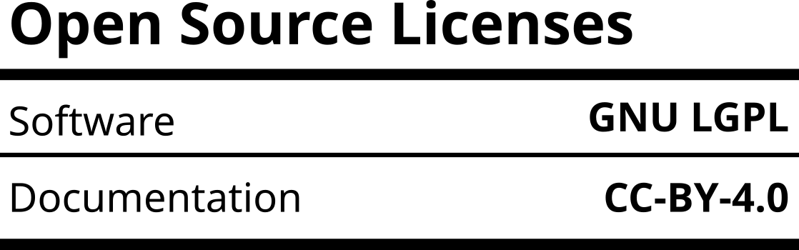

Welcome to Py4ModPhotoreactor
=================================

This program controls the controller of the `modularPhotoreactor <https://github.com/photonZfeed/modularPhotoreactor>`_.

Documentation
-------------

The program is documented with docstrings in the code. A html-version of the documentation can be found here
`<./docs/build/index.html>`__.

Licensing
---------

This project is open source. The software is released under the **GNU Lesser General Public Licence** (GNU LGPL). The hardware is released under the **CERN Open Hardware Licence Version 2 - Weakly Reciprocal Licence**.
Please find the licenses `here <License.rst>`_.

More Information
----------------

Cite this repository:

.. image:: https://zenodo.org/badge/665896009.svg
   :target: https://zenodo.org/badge/latestdoi/665896009

Publications
------------

`D. Kowalczyk, P. Li, A. Abbas, J. Eichhorn, P. Buday, M. Heiland, A. Pannwitz, F. Schacher, W. Weigand, C. Streb and D. Ziegenbalg, Making Photocatalysis Comparable Using a Modular and Characterized Open-Source Photoreactor, ChemPhotoChem, 2022, 6, e202200044, DOI: 10.1002/cptc.202200044 <(https://doi.org/jfg6)>`_

`S. Naskar, D. Kowalczyk, S. Mal, S. Das, D. Mandal, P. Kumar and D. Ziegenbalg, Making photochemistry scalable – an operationally simple falling film looping photoreactor, Reaction Chemistry & Engineering, DOI: 10.1039/d3re00107e. <https://doi.org/kjpj>`_

Modular Controller Script
-------------------------

To run the modular controller script required for the operation of the
modular photoreactor controller follow the steps below:

-  start the console and install mod_reactor_controller with (venv is
   recommended)

.. code:: console

   pip install "directory of the controller_documentation folder"

-  copy the "conf" folder to the working directory in which you want to
   run the controller script
-  modify the config files according to the modules and tinkerforge
   bricklets you use
-  use the console to navigate to the working directory in which you
   want to run the controller script

.. code:: console

    cd "your directory"

-  start python in the console

.. code:: console

    python

-  start the controller

.. code-block:: python

    >>> from Py4ModPhotoreactor import controller
    >>> controller.start()

-  **press any key** to interrupt the program

Programmable Intensity Ramps
----------------------------

This program controls a **Korad** or **RND** **KA3005P** power supply to
realize programmable intensity profiles for a radiation source.

-  follow the steps outlined above to install mod_reactor_controller
-  start python in the console

.. code:: console

   python

-  start the controller

.. code-block:: python

    >>> from mod_reactor_controller import multi_ramp
    >>> multi_ramp.start()

-  start the connection to the power supply. If standard values do not work, set the USB port to which your power supply
   is connected through the keyword argument "port", e.g. "port = '/dev/ttyACM0'"*

- set the voltage

.. code-block:: console

     Voltage? 5

-  define the intensity ramp. Several ramps can be defined one after another

.. code-block:: console

     time of the first point in seconds = 0
     current of the first point in ampere = 0
     time of the second point in seconds = 20
     current of the second point in ampere = 0.1
     add ramp? (y / press key to interrupt)

-  press any key besides y and enter to start irradiation with the intensity ramp

